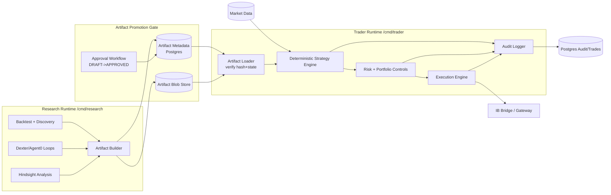

# ADR-0012: Consolidate Jax into a modular monolith with Trader + Research runtimes

- Status: Proposed
- Date: 2026-02-13
- Owner: Architecture review

## Context

The current repository is already a single monorepo, but runtime behavior is effectively distributed over multiple HTTP services in `docker-compose.yml` (`jax-api`, `jax-orchestrator`, `jax-signal-generator`, `jax-market`, `jax-trade-executor`, `jax-memory`, `agent0-service`, `ib-bridge`, `hindsight`).

Evidence of service-level boundaries and network calls:

- `jax-api` calls orchestrator over HTTP (`JAX_ORCHESTRATOR_URL`) in `services/jax-api/internal/infra/http/handlers_orchestration_v1.go`.
- `jax-signal-generator` calls orchestrator over HTTP in `services/jax-signal-generator/internal/orchestrator/client.go`.
- `jax-orchestrator` creates HTTP clients to Memory, Agent0, and Dexter in `services/jax-orchestrator/cmd/jax-orchestrator-http/clients.go`.
- UTCP provider config mixes local and HTTP transports in `config/providers.json`.

The repo also vendors external systems:

- `services/hindsight/` is vendored at a pinned upstream commit (see `services/hindsight/UPSTREAM.md`).
- `dexter/` is a full standalone repo with its own runtime/dependencies.
- `Agent0/` is present as a vendored reference, while integration happens via `services/agent0-service` and `libs/agent0` HTTP client.

We want to keep a single codebase but split into two deployables:

1. Trader runtime (deterministic, risk-controlled, audit-first, minimal dependencies).
2. Research runtime (experimental, backtests, Hindsight, Dexter/Agent0 loops).

Promotion boundary is artifact-based, not code-based.

## Decision

Adopt a modular monolith design with two entrypoints and strict import boundaries:

- `cmd/trader` deployable for production-safe execution.
- `cmd/research` deployable for experimentation and strategy generation.

Both entrypoints depend on shared internal modules, but Trader only accepts approved, immutable strategy artifacts.

## Proposed target module layout

```text
cmd/
  trader/
    main.go
  research/
    main.go

internal/
  app/
    trader/                # runtime composition for trader
    research/              # runtime composition for research

  domain/
    strategy/
    risk/
    execution/
    portfolio/
    marketdata/
    artifacts/
    audit/

  ports/
    marketdata.go
    broker.go
    storage.go
    memory.go
    research_tools.go
    artifact_store.go

  modules/
    marketdata/
    strategy/
    risk/
    execution/
    portfolio/
    artifacts/
    storage/
    observability/

  integrations/
    ib/
    polygon/
    alpaca/
    postgres/
    hindsight/
    dexter/
    agent0/

  policy/
    importcheck/           # static boundary checks
```

### Dependency rules

1. `cmd/trader` may import only:
   - `internal/app/trader`
   - domain/modules required for deterministic execution
   - approved integrations (`ib`, `postgres`, market data adapters)
2. `cmd/trader` must NOT import:
   - `internal/app/research`
   - `internal/integrations/dexter`
   - `internal/integrations/agent0`
   - `internal/integrations/hindsight`
3. `cmd/research` can import both deterministic modules and research integrations.
4. Enforce rules with:
   - package placement (`internal/research/...` unreachable by trader wiring), and
   - CI static checks (`go list -deps ./cmd/trader | rg ...` denylist).

## Artifact promotion contract

Define immutable strategy artifact as canonical JSON + sha256 digest.

```json
{
  "artifact_id": "strat_rsi_momentum_2026-02-13T12:34:56Z",
  "schema_version": "1.0.0",
  "strategy": {
    "name": "rsi_momentum",
    "version": "2.1.3",
    "code_ref": "git:commit-sha-or-tag",
    "params": {"rsi_period": 14, "entry": 30, "exit": 70}
  },
  "data_window": {
    "from": "2022-01-01T00:00:00Z",
    "to": "2026-01-31T23:59:59Z",
    "symbols": ["AAPL", "MSFT"]
  },
  "validation": {
    "backtest_run_id": "uuid",
    "metrics": {"sharpe": 1.42, "max_drawdown": 0.12, "win_rate": 0.54},
    "determinism_seed": 42,
    "report_uri": "s3://.../validation-report.html"
  },
  "risk_profile": {
    "max_position_pct": 0.20,
    "max_daily_loss": 1000,
    "allowed_order_types": ["LMT"]
  },
  "created_by": "research-runtime",
  "created_at": "2026-02-13T12:35:01Z",
  "hash": "sha256:...",
  "signature": "optional-kms-signature"
}
```

### Approval state machine

`DRAFT -> VALIDATED -> REVIEWED -> APPROVED -> ACTIVE -> DEPRECATED -> REVOKED`

Rules:
- Only `APPROVED` and non-revoked artifacts are loadable by Trader.
- Promotion requires recorded approver identity + timestamp + validation evidence.
- Hash must match immutable payload bytes.

### Storage recommendation

Use Postgres metadata + object payload:
- Postgres tables for metadata, approvals, lifecycle transitions, and audit links.
- Object store (S3/MinIO) for immutable artifact blobs and heavy validation reports.

Suggested tables:
- `strategy_artifacts`
- `artifact_approvals`
- `artifact_promotions`
- `artifact_validation_reports`

Trader startup/load path:
1. Query latest `APPROVED` artifact for strategy.
2. Fetch payload blob by URI.
3. Verify SHA-256 hash (and optional signature).
4. Log artifact id/version/hash into audit stream and trade records.

## Migration plan (incremental strangler)

### Phase-by-phase delivery plan (execution view)

| Phase | Goal | Primary code touchpoints | Validation gate | Rollback trigger |
|---|---|---|---|---|
| 0 (Baseline) | Lock current behavior before refactors | `services/jax-api/internal/app/*`, `services/jax-orchestrator/internal/app/*`, `services/jax-trade-executor/*` tests | Golden tests + integration tests stable for 7 consecutive CI runs | Golden mismatch > 0.5% or unresolved flaky tests |
| 1 (Research collapse A) | Remove `jax-signal-generator -> jax-orchestrator` HTTP hop | `services/jax-signal-generator/internal/orchestrator/client.go`, new in-process orchestration module | Signal decisions and DB writes match baseline replay set | Any non-equivalent orchestration run record on replay |
| 2 (Research collapse B) | Remove `jax-api -> jax-orchestrator` HTTP hop | `services/jax-api/internal/infra/http/handlers_orchestration_v1.go`, shared orchestration service | API contract parity for `/api/v1/orchestrate*`, latency non-regression | Contract-test failure or p95 latency regression > 15% |
| 3 (Trader runtime) | Move execution into `cmd/trader` + internal modules | `services/jax-trade-executor/*` (migrate), `cmd/trader/main.go`, `internal/modules/execution` | Decision golden tests + deterministic replays + IB mock smoke test | Decision drift on replay or risk-control failure |
| 4 (Artifact gate) | Enforce approved artifacts only for Trader | new artifact tables + `internal/domain/artifacts` + trader loader | Trader rejects non-approved artifacts and logs hash/version on every decision | Any path allowing unapproved artifact load |
| 5 (Cutover) | Decommission internal HTTP service splits | compose/runtime wiring, runbooks | Two-runtime smoke (Trader + Research) + incident drill pass | Failed cutover drill or missing observability coverage |

### Phase-by-phase implementation backlog (first-pass tickets)

1. **Phase 0 / Ticket set**
   - Add golden fixtures for signal generation and trade execution decisions.
   - Add replay harness: fixed market snapshots + fixed strategy inputs.
   - Pin deterministic clocks/seeds in tests where needed.

2. **Phase 1 / Ticket set**
   - Introduce orchestration interface in shared module.
   - Replace HTTP client invocation path in signal generator with in-process adapter.
   - Keep old HTTP endpoint as compatibility adapter while migrations run.

3. **Phase 2 / Ticket set**
   - Refactor `handlers_orchestration_v1` to call orchestration application service directly.
   - Preserve response shape and status codes exactly.
   - Add contract tests for orchestrate endpoints before and after refactor.

4. **Phase 3 / Ticket set**
   - Create `cmd/trader` composition root.
   - Move execution/risk composition from service entrypoint to reusable internal module.
   - Add import-boundary check to fail if Trader pulls research-only deps.

5. **Phase 4 / Ticket set**
   - Add SQL migration for `strategy_artifacts`, `artifact_approvals`, `artifact_promotions`, `artifact_validation_reports`.
   - Implement canonical serialization + `sha256` verification.
   - Enforce approval-state checks in trader artifact loader.

6. **Phase 5 / Ticket set**
   - Remove obsolete service wiring from compose/deploy scripts.
   - Produce updated runtime + operational runbooks.
   - Run game-day scenario: artifact revocation + trader restart + audit validation.

### Phase 0: Baseline + contracts
- Freeze external behavior using golden API tests around current endpoints.
- Define domain interfaces for market/risk/execution/storage/orchestration.
- Introduce in-process adapters behind current HTTP handlers.

Exit criteria:
- Existing service integration tests pass.
- Golden tests for signal and execution decisions are stable.

### Phase 1: Collapse signal + orchestration boundary first
Reason: this is currently direct HTTP (`jax-signal-generator` -> `jax-orchestrator`) and easiest to replace with in-process call while preserving logic.

Steps:
1. Move orchestration client interface into shared module.
2. Replace HTTP client call with in-process orchestrator module invocation inside research runtime.
3. Keep old HTTP endpoint as compatibility shim.

Exit criteria:
- Signal generation outputs and orchestration run records match baseline.
- No change in DB side effects for equivalent inputs.

### Phase 2: Collapse jax-api orchestration hop
Steps:
1. Replace `handlers_orchestration_v1` outbound HTTP with module call.
2. Keep API contract unchanged.

Exit criteria:
- API parity tests pass for `/api/v1/orchestrate*`.
- p95 latency non-regressive.

### Phase 3: Consolidate trade execution path into Trader runtime
Steps:
1. Move `jax-trade-executor` logic into `internal/modules/execution`.
2. Keep IB bridge as external process boundary (network/protocol adapter).
3. Wire trader runtime with deterministic scheduler/event loop.

Exit criteria:
- Execution golden tests (position sizing, order generation) pass.
- Replay tests over historical approved signals reproduce identical decisions.

### Phase 4: Introduce artifact gate
Steps:
1. Add artifact tables/store and promotion workflow.
2. Switch trader strategy loading from raw configs to approved artifacts only.

Exit criteria:
- Trader refuses non-approved artifacts.
- Audit logs include artifact id/version/hash per decision and trade.

### Phase 5: Decommission internal-only service processes
- Retire separate processes for in-repo modules now hosted in same runtime.
- Keep only justified external boundaries.

Exit criteria:
- docker compose reduced to true externals + two Jax runtimes.
- Operational runbook updated.

## What should remain separate processes

Keep separate:

1. **IB Gateway / IB Bridge**
   - External broker protocol/session constraints; failure isolation and lifecycle concerns differ from core trading engine.
2. **Hindsight** (at least initially)
   - Vendored but operationally independent memory system with different stack and release cadence.
3. **Postgres / observability stack**
   - Infrastructure components, not app modules.

Can be collapsed in-process:
- `jax-signal-generator`, `jax-orchestrator`, and most of `jax-api` orchestration path.
- Shared market/risk/strategy modules already exist in `libs/*` and can be composed directly.

## Risk analysis and mitigations

1. Behavior drift while removing HTTP seams
   - Mitigation: golden tests at module and API boundary; replay tests on historical signals.
2. Hidden coupling/config drift
   - Mitigation: single typed runtime config package and env mapping tests.
3. Determinism regressions in Trader
   - Mitigation: fixed-seed tests, stable iteration ordering, ban wall-clock dependency in decision path.
4. Performance regressions
   - Mitigation: before/after benchmarks for signal generation and execution hot paths.
5. Dependency contamination (Trader importing research libs)
   - Mitigation: package boundaries + CI import denylist checks.

## Test strategy

- Golden tests: signal generation decisions and trade execution sizing.
- Replay tests: historical market snapshots + approved artifact -> deterministic output.
- Contract tests: artifact loader (hash verification, state checks, signature path).
- End-to-end smoke: Trader startup with approved artifact and IB bridge mock.
- Research determinism tests: backtest runs with fixed seed produce identical metrics.

## Concrete first code changes

1. Add entrypoints:
   - `cmd/trader/main.go`
   - `cmd/research/main.go`
2. Create artifact domain + storage interfaces:
   - `internal/domain/artifacts/*.go`
   - `internal/ports/artifact_store.go`
3. Create trader/research runtime composition roots:
   - `internal/app/trader/runtime.go`
   - `internal/app/research/runtime.go`
4. Extract orchestration use case from HTTP handlers:
   - new module in `internal/modules/orchestration`
   - adapt `services/jax-api/internal/infra/http/handlers_orchestration_v1.go`
   - adapt `services/jax-signal-generator/internal/orchestrator/client.go`
5. Add CI import-boundary check for Trader deps.
6. Add migration SQL for artifact metadata tables.

## Mermaid diagram



## Consequences

Positive:
- Keep monorepo simplicity and local refactoring speed.
- Strong Trader safety boundary via artifacts + import rules.
- Easier future extraction if needed via clean module interfaces.

Tradeoffs:
- Requires disciplined dependency governance.
- Transitional complexity while compatibility shims coexist.
