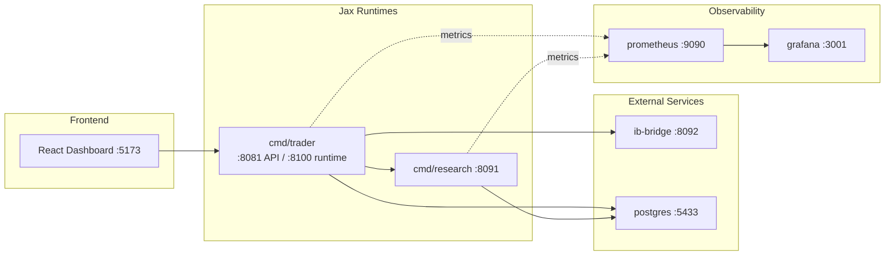

# Architecture Diagram

## Notes

- The old `services/jax-*` runtime graph is superseded by `cmd/trader` + `cmd/research`.
- `ib-bridge` is the retained external market-connectivity boundary; planning
  is owned by the in-process Jax planner.
- For operational commands and troubleshooting, use `Docs/SETUP/QUICKSTART.md`, `Docs/OPERATIONS/OPERATIONS.md`, and `Docs/OPERATIONS/DEBUGGING.md`.
