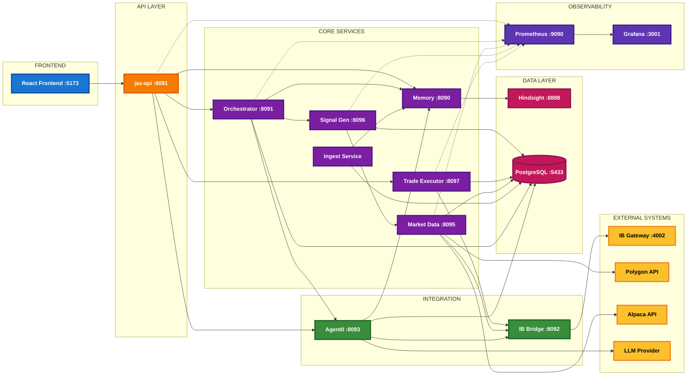

# JAX Trading Assistant - Architecture Diagram

This diagram shows the complete system architecture including all services, external integrations, and data flows.

## How to View

1. **VS Code**: Install the "Markdown Preview Mermaid Support" extension
2. **Online**: Copy the diagram code to https://mermaid.live
3. **GitHub**: This will render automatically when viewing on GitHub

## Architecture Diagram

## Component Details

### Frontend Layer (Blue)
- **React/Vite Frontend** (Port 5173) - Dashboard, trading UI, and system monitoring interface

### API Gateway (Orange)
- **jax-api** (Port 8081) - Main REST API with JWT authentication, CORS policies, and rate limiting

### Core Services (Purple)
- **jax-orchestrator** (8091) - Agent0 pipeline orchestration and workflow management
- **jax-market** (8095) - Market data aggregation from multiple sources
- **jax-signal-generator** (8096) - Trading signal generation based on strategies
- **jax-trade-executor** (8097) - Trade execution with integrated risk management
- **jax-memory** (8090) - UTCP memory facade (retain/recall/reflect operations)
- **jax-ingest** - Data ingestion service with Dexter integration

### Integration Services (Green)
- **ib-bridge** (8092) - Python FastAPI bridge connecting to Interactive Brokers via ib_insync
- **agent0-service** (8093) - AI agent service with LLM integration (Ollama/OpenAI/Anthropic)

### Backend Services (Pink)
- **Hindsight** (8888) - Vector-based memory backend and storage
- **PostgreSQL** (5433) - Primary database storing trades, positions, market data, and strategies

### Observability Stack (Light Purple)
- **Prometheus** (9090) - Metrics collection from all services
- **Grafana** (3001) - Dashboard and visualization for system monitoring

### Shared Libraries (Teal)
Located in `libs/` directory:
- **UTCP** - Universal Tool Calling Protocol implementation
- **Contracts** - Shared DTOs and schema definitions
- **Observability** - Logging and tracing utilities
- **Auth** - JWT and security implementations
- **Trading** - Core trading domain logic
- **Resilience** - Retry and circuit breaker patterns

### External Systems (Yellow)
- **IB Gateway/TWS** (4002) - Interactive Brokers trading platform
- **Polygon/Alpaca APIs** - External market data providers
- **LLM Providers** - Ollama (local), OpenAI, or Anthropic for AI capabilities

## Architecture Principles

This system follows **Clean Architecture / Hexagonal Architecture** principles:

1. **Service Boundaries**: Each service under `services/` maintains its own `internal/` packages
2. **Dependency Rules**:
   - `internal/domain` - No external dependencies
   - `internal/app` - May import domain only
   - `internal/infra` - Implements adapters, can import app and domain
3. **Shared Stability**: Common code in `libs/` is well-tested and stable
4. **Interface Orientation**: Interfaces defined in consuming layers, implemented in infrastructure

## Data Flow Examples

### Trading Flow
1. Frontend → API → Signal Generator → Market Service
2. Signal Generator → Trade Executor → IB Bridge → IB Gateway
3. Trade Executor → PostgreSQL (store trade records)

### Memory Flow
1. Agent0 Service → Memory Service → Hindsight (vector storage)
2. Orchestrator → Memory Service (retain/recall operations)

### Market Data Flow
1. IB Bridge → Market Service → PostgreSQL
2. External APIs (Polygon/Alpaca) → Market Service → PostgreSQL
3. Market Service → Signal Generator (for analysis)

## Monitoring Flow
All services → Prometheus → Grafana dashboards

---

**Generated**: February 12, 2026  
**Repository**: jax-trading-assistant  
**For latest updates**: See `Docs/ARCHITECTURE.md` and `Docs/PROJECT_OVERVIEW.md`
