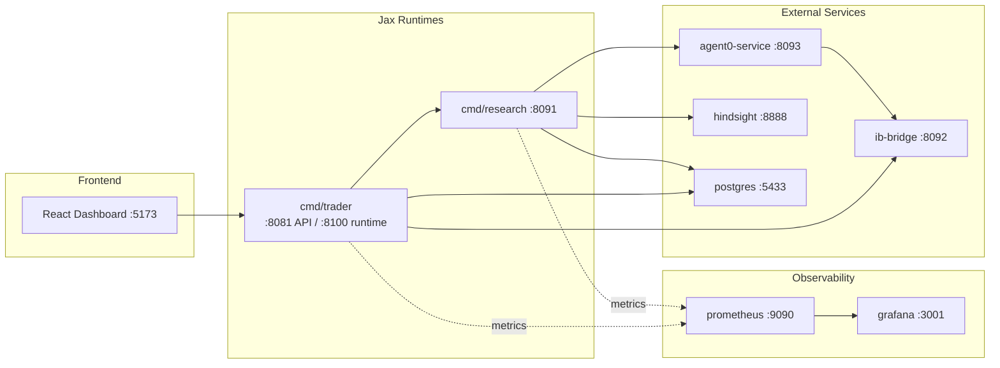

# Architecture Diagram

```mermaid
flowchart LR
  subgraph UI["Frontend"]
    FE["React Dashboard :5173"]
  end

  subgraph JAX["Jax Runtimes"]
    TRADER["cmd/trader
:8081 API / :8100 runtime"]
    RESEARCH["cmd/research :8091"]
  end

  subgraph EXT["External Services"]
    IBB["ib-bridge :8092"]
    AGENT0["agent0-service :8093"]
    HIND["hindsight :8888"]
    PG["postgres :5433"]
  end

  subgraph OBS["Observability"]
    PROM["prometheus :9090"]
    GRAF["grafana :3001"]
  end

  FE --> TRADER
  TRADER --> RESEARCH
  TRADER --> IBB
  TRADER --> PG
  RESEARCH --> AGENT0
  RESEARCH --> HIND
  RESEARCH --> PG
  AGENT0 --> IBB

  TRADER -. metrics .-> PROM
  RESEARCH -. metrics .-> PROM
  PROM --> GRAF
```

## Notes

- The old `services/jax-*` runtime graph is superseded by `cmd/trader` + `cmd/research`.
- `ib-bridge`, `agent0-service`, and `hindsight` are retained external boundaries.
- For operational commands and troubleshooting, use `Docs/QUICKSTART.md`, `Docs/OPERATIONS.md`, and `Docs/DEBUGGING.md`.
