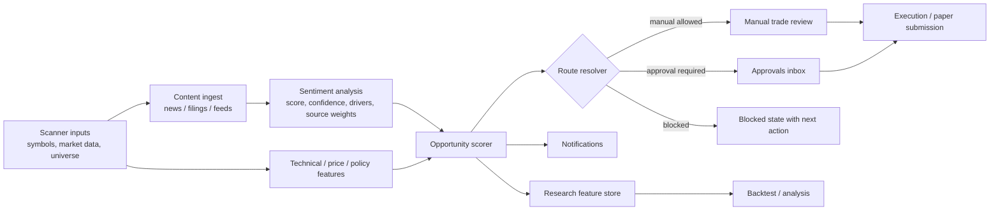

# UX and Product Redesign Plan for Jax Trading Assistant With Integrated Trading Sentiment Analysis

## Executive summary

Jax Trading Assistant already has the raw platform pieces for a strong beginner-friendly, AI-first trading product, but the current `work` branch still exposes internal architecture more clearly than user value. Navigation is crowded and module-led, the main trading experience is panel-heavy, AI is fragmented across several screens, approvals are split across multiple nouns and flows, backtesting is too technical for non-specialists, and there is no first-class sentiment-analysis layer in the scanner, evidence model, notifications, or research workflows. The current frontend types and UI surfaces do not expose sentiment-specific settings, sentiment-derived evidence, or sentiment-specific alert logic. fileciteturn16file0L3-L3 fileciteturn15file0L3-L3 fileciteturn19file0L3-L3 fileciteturn26file0L3-L3 fileciteturn44file0L3-L3 fileciteturn41file0L3-L3 fileciteturn24file0L3-L3

The right redesign is not to bolt sentiment on as yet another analytics widget. It is to make **one coherent AI Trading workflow** where scanner state is visible, sentiment is a configurable evidence input, opportunities are explained in plain language, approvals remain policy-safe, alerts are durable and understandable, backtests can include sentiment as a feature family, and every state shows the user what to do next. Sentiment should affect scoring, ranking, urgency, expiry, and explanation quality, but it should **not** silently bypass policy or remove the human role in approval-gated flows. That approach fits NN/g’s recommendations on progressive disclosure, visibility, recognition over recall, plain language, and in-context help, and it fits NIST’s emphasis on clearly defined human roles and human oversight in human-AI systems. citeturn7view0turn7view2turn7view4turn8view0turn8view3turn17view0

The practical shape of the redesign is straightforward. Unify user-facing AI nouns around **Opportunity**. Create a dedicated **AI Trading** home. Add sentiment scope, time-window, and threshold controls to the scanner. Extend opportunity explainability with sentiment drivers, weighted source breakdown, time-window context, and price-versus-sentiment agreement or divergence. Add sentiment-triggered alerts to a durable notification centre. Make sentiment visible in approvals without letting it replace risk or policy. Wrap backtesting in a wizard that can run with or without sentiment features and then save live or paper settings from the result. Build it incrementally by adding read models and adapters over the APIs and data shapes that already exist in the repo. fileciteturn56file0L3-L3 fileciteturn61file0L3-L3 fileciteturn40file0L3-L3 fileciteturn43file0L3-L3

## What I needed to learn

**Enabled connectors available and used first:**  

- **github**

### The key things I needed to learn to answer well

- how the current `work` branch organises navigation, routes, pages, and beginner-facing entry points
- how AI recommendations, signals, candidate trades, approvals, and manual ETF blocking currently work
- how research, backtests, and analysis are currently created, configured, and promoted
- where notifications, event streaming, and mobile approval hooks already exist
- which UX, human-AI interaction, explainability, and notification-permission principles should guide a safer redesign fileciteturn16file0L3-L3 fileciteturn15file0L3-L3 fileciteturn41file0L3-L3 fileciteturn20file0L3-L3 fileciteturn26file0L3-L3 fileciteturn56file0L3-L3 citeturn7view0turn7view2turn17view0turn15view2

## Current-state diagnosis and repo findings

The top-level information architecture is the first problem. `AppShell` currently exposes a large, mixed-purpose navigation surface that includes Dashboard, Trading Modules, separate Equity Alpha and ETF module trees, and a long bottom section with System, Backtesting, Analysis, Testing, Paper Trading Test Plan, Mobile Approval Harness, E2E Tests, Portfolio, Blotter, Settings, Assistant, and User Guide. `App.tsx` also carries redirects and legacy route aliases. For a beginner, that is architecture as navigation. NN/g’s “match between the system and the real world” heuristic strongly argues for user language over internal jargon, and its minimalist-design guidance is equally clear that every extra interface element competes with what matters. fileciteturn16file0L3-L3 fileciteturn15file0L3-L3 citeturn7view3turn8view1

The main interaction surfaces are too dense for a first-run experience. The dashboard opens with health, watchlist, positions, risk, signal queue, and AI assistant panels. The trading page adds watchlist, order ticket, positions, risk, blotter, price chart, strategy monitor, signals queue, and AI assistant, with all panels open by default. Jax already has panel collapse state, but it is being used as density management rather than progressive disclosure. That is a missed opportunity, because NN/g explicitly recommends staged and progressive disclosure as a way to keep complex systems learnable without removing expert controls. fileciteturn17file0L3-L3 fileciteturn19file0L3-L3 citeturn7view0turn7view1

AI is fragmented across too many surfaces and still does not read as a primary workflow. The current branch exposes AI through a dashboard panel, a trading-page panel, an advisory-only Assistant page, the signal queue, and candidate evidence. The `SignalsQueuePanel` is especially revealing: AI analysis is optional per signal and can be triggered with “Run AI” if it has not yet been generated. That makes AI feel like an extra action rather than the engine of the product. The data types in `types.ts` do not expose any sentiment-specific configuration either, which means there is currently no concept of sentiment scope, sentiment threshold, sentiment time window, source weighting, or sentiment confidence in the user-facing model. fileciteturn41file0L3-L3 fileciteturn31file0L3-L3 fileciteturn44file0L3-L3

Approval and policy handling are directionally right but product-wise confusing. The app currently allows pending signals to be approved, rejected, or analysed in one place, while ETF candidates flow through a dedicated approval queue in another. Meanwhile, the manual order ticket blocks ETF entries and tells the user to use the approval queue instead. The UAT paper-trading doc confirms that the pilot is meant to run with ETF candidate approval rather than direct manual entry. So the guardrail is not the issue. The issue is that the user learns it late, and through different nouns, pages, and statuses. That is exactly the kind of ambiguity that should be removed by a single Opportunity model and a single route-resolution step that happens before the user commits cognitive effort to the wrong path. fileciteturn41file0L3-L3 fileciteturn20file0L3-L3 fileciteturn21file0L3-L3 fileciteturn22file0L3-L3 fileciteturn55file0L3-L3 fileciteturn59file0L3-L3

Backtesting is powerful but currently too operator-shaped. The user guide and Research page assume comfort with strategy instances, type IDs, timezones, flatten-by-close settings, artifact IDs, config JSON, dataset snapshots, and project-grid JSON. If data is missing, the UI tells users to add datasets into the repo structure and restart the research service. That is perfectly sensible for an engineer and perfectly brutal for a beginner. The good news is that the Analysis page already has the right depth: metrics, trade list, events, timeline, and export. The redesign should therefore keep the engine and completely change the front door. fileciteturn10file0L3-L3 fileciteturn26file0L3-L3 fileciteturn27file0L3-L3 fileciteturn28file0L3-L3 fileciteturn29file0L3-L3

The explainability pattern is also only half there. `CandidateTradeSummary` already shows a headline, source, priced-in score, confounders, and risk controls. That means the opportunity detail pattern already exists conceptually. What is missing is a structured explanation of why the AI cares about that information, how each evidence family contributed, what time window was used, how reliable the source set is, what sentiment adds to the conviction, and what invalidates the idea. That gap is where sentiment should go. Not as a side chart, but as an evidence layer integrated into the existing summary model. NIST’s human-AI interaction guidance and the model-cards literature both support this direction: users need context, limits, and intended use, not just an opaque output. fileciteturn24file0L3-L3 fileciteturn25file0L3-L3 citeturn17view0turn18view0turn19view0

Notifications are also under-designed. The backend already exposes an event stream, the signal queries poll regularly, approvals refresh on a cadence, and the repo includes a mobile Telegram approval harness. But the product still lacks a user-facing notifications centre, durable inbox semantics, and a clean channel-preferences experience. MDN and web.dev are very clear here: notification permissions should be requested only after clear user intent and obvious benefit, and users should have alternatives and recovery paths rather than being trapped by premature prompts. Jax should treat notifications as a stateful user workflow, not a handful of transient toasts. fileciteturn42file0L3-L3 fileciteturn20file0L3-L3 fileciteturn51file0L3-L3 fileciteturn56file0L3-L3 citeturn13view0turn14view0turn14view1turn15view2

## Redesigned information architecture and core journeys

The redesign should pivot the whole product around **task-first navigation** and **one user-facing AI object**, while keeping the existing backend complexity hidden behind read models and adapters. The new top-level navigation should be:

| Current tendency | New top-level destination | What it is for |
| --- | --- | --- |
| Dashboard / modules / multiple trees | **Home** | first-run understanding and next steps |
| scattered AI surfaces | **AI Trading** | scanner, opportunities, explainability, watch, route |
| order-ticket-centric mixed surface | **Manual Trading** | clear manual path for allowed instruments |
| ETF approvals as separate mental model | **Approvals** | one decision centre for approval-required opportunities |
| instance/project-oriented entry | **Research** | guided backtesting and setup |
| deep metrics page | **Analysis** | results interpretation and comparison |
| missing durable alert home | **Notifications** | inbox, channels, and preferences |
| settings plus admin mixed in nav | **Settings** | personalisation, advanced controls, role-gated admin |

Everything that is clearly operational or educational but not core to first-run user value — System, Testing, Paper Trading Test Plan, Mobile Approval Harness, E2E Tests, raw guides, static strategy cards, and static universe pages — should move into Settings → Admin & QA or a contextual Learn mode. That preserves capability without forcing every new user to walk through the engine room. fileciteturn16file0L3-L3 fileciteturn39file0L3-L3 fileciteturn48file0L3-L3 fileciteturn50file0L3-L3 citeturn8view1turn8view3

The naming model should also be simplified:

| Current wording | Proposed wording | Rationale |
| --- | --- | --- |
| Signal | Opportunity | user-facing action object |
| Candidate trade | Proposed trade | easier to understand |
| Strategy instance | Saved setup | plain English |
| Dataset snapshot | Historical data set | plain English |
| Trading approvals | Opportunity queue | one mental model |
| Re-analyse | Run deeper analysis | clearer intent |
| Trading modules | Choose workflow | removes internal jargon |
| ETF module | Approval-gated ETFs | says what is different |
| Equity Alpha module | Equity manual trading | says what the user is doing |
| Assistant | Ask Jax | contextual helper, not a separate mental model |

The redesigned journeys should work like this:

### First-time onboarding journey

1. Home page explains in one sentence what Jax does.
2. User chooses one of three first goals: find AI opportunities, place a manual trade, or test a strategy.
3. If AI is chosen, the user goes straight into AI Trading Home with defaults prefilled.
4. Jax explains notifications before asking for permission.
5. User reviews one demo opportunity, including sentiment, route, and next action.
6. A first-run checklist tracks completion and offers “Teach me” content.
**Key decision:** product promise before complexity, value before permissions, examples before jargon.

### AI scanning and alert journey

1. User opens AI Trading Home.
2. Scanner state shows on/off, symbols/universe, interval, confidence threshold, sentiment sources, sentiment time window, and sentiment threshold.
3. User enables scanning with defaults in one step.
4. Scanner produces an opportunity when price/technical/news/sentiment logic passes threshold.
5. User receives a durable alert and lands directly in the opportunity drawer.
6. User either sends to approval, reviews order, watches, or dismisses.  
**Key decision:** AI scanner is visible, not hidden, and sentiment is part of the scanner state rather than an afterthought.

### Trade approval journey

1. Opportunity detail says whether the route is manual-allowed, approval-required, or blocked.
2. Approval-required opportunities are sent to Approvals with evidence and policy context attached.
3. Approver sees strategy evidence, price context, sentiment context, route reason, expiry, and clear CTA.
4. Approve, reject, defer, or request deeper analysis.
5. Decision history persists with notes and override reasons.  
**Key decision:** sentiment can add evidence and priority, but it never silently overrides approval policy.

### Manual trade journey

1. User types a symbol into Manual Trading.
2. Jax performs a route check before full ticket entry.
3. If the symbol is manual-allowed, the ticket proceeds.
4. If approval is required, the screen swaps to a policy card and offers “Open approval flow”.
5. If blocked, the UI explains why and gives a recovery path.  
**Key decision:** prevent dead ends and late-stage cognitive waste.

### Backtesting to deployment journey

1. User opens Research and picks a strategy template in plain language.
2. User chooses market, period, and whether to enable sentiment features.
3. Advanced settings, including raw JSON and feature tuning, stay hidden under Advanced.
4. Run backtest with defaults.
5. Result summary interprets performance in plain language and shows sentiment contribution if enabled.
6. User opens full Analysis or saves a paper-ready setup.  
**Key decision:** no-JSON beginner path, expert-safe advanced path, explicit handoff into paper/live setup.

## Sentiment-integrated AI trading and UX flows

The key product decision is this: **sentiment should be treated as a first-class evidence family, not as a magical oracle and not as a stand-alone module**. NIST notes that human-AI decision configurations need clearly defined roles, and research on explainable AI suggests that explanations do not automatically improve decision-making unless they are integrated into a decision structure users can actually work with. So sentiment in Jax should do four jobs: improve scanner ranking, enrich explainability, trigger or suppress relevant alerts, and create testable backtest features. It should not auto-trade by itself, and it should not silently bypass approval gating. citeturn17view0turn19view0turn18view0

The new **AI Trading Home** should show scanner state at the top, including normal scanner controls and sentiment controls. At minimum, the user should be able to configure:

- sentiment source scope
- sentiment time window
- minimum sentiment magnitude threshold
- minimum source count
- source trust weighting mode
- whether sentiment acts as a filter, rank boost, or required feature
- whether divergence between price and sentiment should create alerts

For beginners, the default should be conservative: trusted news only, short-to-medium time window, sentiment used as a boost/filter rather than the sole trigger, and plain-language labels like “Strongly positive recent coverage” rather than unexplained raw numbers. That keeps the system understandable while still making AI feel genuinely useful. citeturn7view3turn8view3

The **Opportunity detail explainability** layer should explicitly incorporate sentiment. The drawer should include:

- a sentiment summary sentence
- current sentiment score and direction
- weighted sentiment breakdown by source type
- time window used
- top sentiment drivers
- source list with timestamps
- agreement or divergence between price action and sentiment
- contribution of sentiment to overall confidence
- limitations, such as sparse sources or low-trust inputs

That is where Jax can make sentiment transparent rather than black-box. The user should not see “Sentiment +0.61” and be expected to guess what that means. The UI should say something more like: “Net positive news tone across 7 recent sources over the last 4 hours. Strongest drivers: Fed commentary, analyst upgrade, above-consensus guidance. Price and sentiment agree.” citeturn17view0turn18view0

The **notification model** should become sentiment-aware but still restrained. Good sentiment-triggered alerts include:

- a new opportunity where sentiment materially increases conviction
- a sentiment flip that invalidates or drops conviction on a watched idea
- strong sentiment divergence where price and coverage disagree and need review
- approval-required opportunities where sentiment materially strengthens or weakens the case
- completed backtests for sentiment-enabled strategies

Bad sentiment-triggered alerts are low-context “score changed by 0.03” noise. Alerts must be based on meaningful thresholds, connect to obvious user value, and land in a durable inbox. Browser permission should only be requested after the user explicitly chooses desktop alerts and understands what they will get. citeturn14view0turn14view1turn15view2turn15view3

The **risk and policy UX** should make sentiment advisory but relevant. A sensible routing model is:

- **manual-allowed** instruments: sentiment can boost urgency, change ranking, alter expiry, or create a “review now” alert
- **approval-required** instruments: sentiment is displayed in the evidence pack and can affect queue priority or required explanation depth
- **blocked** states: sentiment never removes policy blocks, but it can help explain why a trade is still interesting or why it should stay blocked

The most important rule is that **sentiment must never bypass the human role** in approval-gated ETFs. NIST’s AI RMF is very clear that human roles and responsibilities in AI-supported decisions should be differentiated and explicit. In Jax, that means sentiment can strengthen the case, shorten the review queue, or trigger deeper analysis, but not silently grant entry authorization. citeturn17view0

The **beginner UX strategy** should include a specific way to teach sentiment. Every major page should support a “Teach me” mode, and the sentiment-related labels should be translated into plain language. For example:

- “Sentiment score” → “How positive or negative recent coverage is”
- “Source-weighted sentiment” → “Weighted by source reliability”
- “Divergence” → “Price and coverage disagree”
- “Time window” → “How far back Jax looked”
- “Magnitude threshold” → “How strong the view must be before Jax cares”

That is much closer to the heuristics from NN/g and the plain-language guidance than exposing finance-NLP jargon raw. citeturn7view4turn8view0turn8view3

The **backtesting redesign** should let users test sentiment-enabled strategies without becoming data engineers. The wizard should ask whether the user wants:

- no sentiment
- news sentiment only
- news plus source weighting
- sentiment as a filter
- sentiment as a ranking boost
- sentiment divergence signals
- sentiment decay window selection

The result summary should then show the impact of sentiment features in plain language, for example:

- baseline strategy vs sentiment-enhanced strategy
- signal count delta
- win-rate delta
- drawdown delta
- average holding-time delta
- whether sentiment helped in breakouts, reversals, or simply filtered noise

That lets the user decide whether sentiment belongs in a paper or live setup without having to read raw feature configs. fileciteturn26file0L3-L3 fileciteturn29file0L3-L3

The wireframe guidance below folds sentiment directly into the redesigned screens.

```text
AI TRADING HOME
┌──────────────────────────────────────────────────────────────────────────────┐
│ Jax scans markets, news, and sentiment to surface trade opportunities.      │
│ Scanner: ON  Scope: ETFs + Equities  Interval: 5m  Confidence: 70%          │
│ Sentiment: Trusted news only  Window: 4h  Threshold: Medium+  Divergence: On│
│ Last scan: 09:42  Next: 09:47  Runtime: Paper  Policy: ETF approval only    │
│ [Pause scanner] [Edit scanner] [Notification settings] [Teach me]           │
├──────────────────────────────────────────────────────────────────────────────┤
│ New opportunities                                                            │
│ SPY  BUY  High confidence  Positive macro tone + breakout   Approval needed │
│ NVDA BUY  Medium confidence Earnings tone + momentum        Manual allowed  │
│ TLT  SELL Medium confidence Hawkish headlines + weakness    Review now      │
├──────────────────────────────────────────────────────────────────────────────┤
│ Coach rail                                                                   │
│ What Jax checks: price • news • sentiment • liquidity • policy              │
│ What sentiment means: recent positive/negative coverage over selected window │
│ What to do next: open one idea • read why • choose the route                │
└──────────────────────────────────────────────────────────────────────────────┘
```

```text
OPPORTUNITY DRAWER
┌──────────────────────────────────────────────────────────────────────────────┐
│ SPY • BUY • High confidence • Detected 09:42                                │
│ Jax thinks SPY may continue higher after positive macro tone and breakout.  │
│ Route: Approval required • Expires in 18m                                   │
├──────────────────────────────────────────────────────────────────────────────┤
│ Why now                                                                     │
│ - Trend breakout confirmed                                                  │
│ - Recent headline tone strongly positive                                    │
│ - Liquidity normal                                                          │
├──────────────────────────────────────────────────────────────────────────────┤
│ Sentiment                                                                    │
│ Score: +0.67 (Strong positive)                                              │
│ Window: Last 4h • Sources: 7 trusted news items                             │
│ Breakdown: Macro +0.30 • Analyst +0.22 • Company-specific +0.15            │
│ Price vs sentiment: Agreeing                                                │
│ Top drivers: CPI surprise, Fed tone, analyst upgrade                        │
├──────────────────────────────────────────────────────────────────────────────┤
│ Chart setup                                                                  │
│ - Breakout above resistance                                                  │
│ - Volume confirmation                                                        │
├──────────────────────────────────────────────────────────────────────────────┤
│ Invalidation                                                                 │
│ - Break back below X                                                         │
│ - Positive tone fades or flips negative                                      │
│ - Volume confirmation disappears                                             │
├──────────────────────────────────────────────────────────────────────────────┤
│ [Send to approval] [Watch] [Dismiss] [Run deeper analysis]                  │
└──────────────────────────────────────────────────────────────────────────────┘
```

```text
NOTIFICATION CENTRE
┌──────────────────────────────────────────────────────────────────────────────┐
│ Notifications                                                                │
│ Filters: [All] [Opportunities] [Approvals] [Backtests] [System] [Sentiment]│
│ Channels: In-app ON • Desktop OFF • Mobile approval ON                      │
├──────────────────────────────────────────────────────────────────────────────┤
│ New opportunity: SPY conviction upgraded by positive sentiment • Review now │
│ Sentiment flip: NVDA watched setup weakened by negative tone • Review       │
│ Approval due: ETF opportunity expires in 12m • Decide now                   │
│ Backtest done: Sentiment filter improved drawdown • View results            │
└──────────────────────────────────────────────────────────────────────────────┘
```

```text
RESEARCH / BACKTEST WIZARD
┌──────────────────────────────────────────────────────────────────────────────┐
│ Research                                                                     │
│ Step 1 Choose a strategy                                                     │
│ [Momentum after news] [Mean reversion] [Breakout]                            │
│                                                                              │
│ Step 2 Choose market and period                                              │
│ Universe [ETFs] Symbols [SPY, QQQ] Dates [Last 6 months]                    │
│                                                                              │
│ Step 3 Sentiment settings                                                    │
│ Sentiment [Off / News only / Weighted / Divergence]                          │
│ Window [1h / 4h / 1d] Threshold [Low / Medium / High]                        │
│                                                                              │
│ Step 4 Run                                                                    │
│ [Run backtest]                                                                │
├──────────────────────────────────────────────────────────────────────────────┤
│ Result summary                                                                │
│ Baseline return +6.1% → Sentiment-enhanced +8.4%                             │
│ Drawdown -5.3% → -4.1%                                                        │
│ Readout: “Sentiment mostly helped by filtering weak breakout entries.”        │
│ [Open full analysis] [Save as paper setup] [Compare runs]                    │
└──────────────────────────────────────────────────────────────────────────────┘
```

```text
ONBOARDING COACH
┌──────────────────────────────────────────────────────────────────────────────┐
│ Get started                                                                  │
│ □ Turn on AI scanning                                                        │
│ □ Choose where alerts go                                                     │
│ □ Review one opportunity                                                     │
│ □ Learn what sentiment means                                                 │
│ □ Run one sample backtest                                                    │
│ □ Save one paper setup                                                       │
│                                                                              │
│ Short explainers                                                             │
│ - What sentiment is                                                          │
│ - Why some trades need approval                                              │
│ - How paper trading differs from live trading                                │
└──────────────────────────────────────────────────────────────────────────────┘
```

## Technical implementation, APIs, data contracts, storage, compute, latency, and model choices

The current repo structure is actually a good fit for an incremental implementation. The frontend already has the route shell, query hooks, page-level services, and type maps that can be extended. The backend already has endpoints for signals, approvals, candidates, pilot status, ETF instruments, backtests, datasets, research projects, and an event stream. The fastest practical approach is to add a sentiment pipeline and expose it through new read models, rather than trying to rework every existing resource at once. fileciteturn13file0L3-L3 fileciteturn15file0L3-L3 fileciteturn56file0L3-L3 fileciteturn61file0L3-L3

On the frontend, the highest-value changes are:

- new `HomePage` and `AiTradingPage`
- new `OpportunityDrawer`
- new `NotificationCentrePage`
- new `ResearchWizardPage`
- new shared scanner settings card including sentiment
- new shared explanation cards for sentiment, news, chart, and policy
- updates to `App.tsx`, `AppShell.tsx`, `types.ts`, `signals-service.ts`, `approvals-service.ts`, and research hooks
- new analytics hooks for opportunity review, sentiment settings, alerts, approvals, and backtest conversions

On the backend, the redesign needs:

- a sentiment ingestion stage for source documents
- a sentiment scoring stage
- a short-term feature store or aggregate layer
- opportunity scoring that combines existing technical/news features with sentiment features
- approval routing logic that can see sentiment evidence but does not hand control away from humans
- backtest support for historical sentiment features
- notification event generation for sentiment-triggered and sentiment-invalidated states

The high-level flow should look like this:



The new API endpoints should be:

| Method | Endpoint | Purpose | Main request / response additions |
| --- | --- | --- | --- |
| GET | `/api/v1/ai/overview` | unified AI home read model | scanner summary, opportunity counts, policy summary, channel summary |
| GET | `/api/v1/ai/scanner` | fetch scanner state | includes sentiment scope, window, threshold, source mode |
| PUT | `/api/v1/ai/scanner` | save scanner state | enablement, symbols/universe, interval, sentiment settings |
| GET | `/api/v1/ai/opportunities` | list user-facing opportunities | route, sentiment summary, confidence, expiry |
| GET | `/api/v1/ai/opportunities/{id}` | full opportunity detail | sentiment breakdown, sources, time window, invalidation, policy |
| POST | `/api/v1/ai/opportunities/{id}/watch` | add to watch list | no major change |
| POST | `/api/v1/ai/opportunities/{id}/dismiss` | dismiss opportunity | reason optional |
| POST | `/api/v1/ai/opportunities/{id}/deeper-analysis` | request richer analysis | may trigger refresh / rescore |
| POST | `/api/v1/ai/opportunities/{id}/promote-to-approval` | route into approval | carries snapshot and reasoning |
| GET | `/api/v1/notifications` | durable inbox | event type, route, sentiment trigger type |
| PUT | `/api/v1/notifications/preferences` | save channel prefs | in-app, desktop, mobile, sentiment alert rules |
| GET | `/api/v1/research/sentiment/features` | list available sentiment features | feature names, windows, source groups |
| POST | `/api/v1/backtests/runs` | run backtest with sentiment options | sentiment config block |
| POST | `/api/v1/backtests/runs/{id}/save-paper-setup` | convert result to paper/live setup | chosen feature flags and thresholds |

The core data contracts should be:

| Contract | Key fields |
| --- | --- |
| `ScannerState` | `enabled`, `assetScope`, `symbols`, `universePreset`, `intervalSeconds`, `minimumConfidence`, `sentiment.enabled`, `sentiment.sourceScope`, `sentiment.window`, `sentiment.threshold`, `sentiment.minSourceCount`, `status`, `lastScanCompletedAt`, `nextScanAt`, `channels`, `policy` |
| `SentimentSummary` | `score`, `label`, `confidence`, `timeWindow`, `sourceCount`, `sourceGroups`, `priceAgreement`, `topDrivers`, `limitations` |
| `OpportunitySummary` | `id`, `symbol`, `signalType`, `confidenceBand`, `summary`, `detectedAt`, `expiresAt`, `route`, `routeReason`, `sentimentSummary`, `status` |
| `OpportunityDetail` | all summary fields plus `chartSetup`, `newsDrivers`, `sentimentBreakdown`, `sourceItems`, `invalidationConditions`, `risk`, `policy`, `limitations` |
| `NotificationEvent` | `id`, `type`, `title`, `body`, `entityType`, `entityId`, `route`, `sentimentTriggerType`, `createdAt`, `readAt`, `deliveryChannels` |
| `BacktestSentimentConfig` | `enabled`, `mode`, `sourceScope`, `window`, `threshold`, `decayMode`, `weightingMode`, `divergenceEnabled` |

A good initial storage model is:

- `news_items` for fetched documents and metadata
- `sentiment_events` for per-document sentiment scores and parsed drivers
- `sentiment_aggregates` for per-symbol per-window rolled-up scores
- `opportunity_sentiment_snapshots` for audit-able opportunity evidence
- `notification_events` and `notification_preferences` for delivery and inbox
- optional `backtest_feature_snapshots` if you want reproducible dataset provenance for research

Because retention is open-ended, I would propose three policy options rather than one imposed answer:

- **Lean retention:** raw document metadata 30 days, derived aggregates 180 days, opportunity snapshots 365 days
- **Balanced retention:** raw metadata 90 days, aggregates 365 days, opportunity snapshots 18 months
- **Audit-first retention:** raw metadata 180 days or more, aggregates multi-year, opportunity snapshots retained per compliance policy

On compute and infra, there are also three sensible deployment shapes:

- **single-service embedded worker** for the fastest first rollout
- **separate background worker with queue** for better resilience and scaling
- **hybrid service split** where scoring and aggregation are backgrounded but read models stay in the existing API service

For latency, I would set these design targets:

- document ingest to sentiment score: **p95 < 60s**
- sentiment aggregate refresh to scanner availability: **p95 < 90s**
- opportunity creation to notification dispatch: **p95 < 15s**
- opportunity detail load: **p95 < 1.5s** on cached summary, **p95 < 3s** on full explainability detail

These are release targets, not claims about current behaviour.

The sentiment implementation options are best treated as an open technical choice with clear trade-offs:

| Option | What it means | Pros | Cons | Best fit |
| --- | --- | --- | --- | --- |
| **In-house model** | self-hosted finance-domain sentiment model and scoring pipeline | strongest control, custom features, no third-party runtime dependency, easiest to align audit trail with product needs | highest setup and maintenance cost, model ops burden, harder cold-start, needs monitoring and re-training plan | teams wanting long-term control and explainability depth |
| **Third-party API** | external provider returns sentiment scores or enriched document analysis | fastest to ship, easiest initial scale, low infra overhead | vendor lock-in, cost volatility, external dependency, limited transparency, harder to tune to Jax-specific scoring | fast MVP with low internal ML bandwidth |
| **Hybrid** | external API for enrichment or fallback, internal logic for aggregation, weighting, routing, and explainability | fastest path to value without giving away product control, easier migration path, strong operational flexibility | more moving parts, more integration logic, requires good abstraction layer | best overall fit for Jax right now |

My recommendation for this repo is **hybrid**. Jax’s product differentiator is not “a generic sentiment score”; it is how sentiment is blended with price, policy, explainability, approvals, and research. That makes provider abstraction and internal aggregation more important than a big-bang commitment to either full self-hosting or full outsourcing.

## Prioritized tickets, metrics, and acceptance criteria

The current branch already has the right touchpoints for a staged implementation, so the best path is to land quick wins first, then build the sentiment pipeline, then mature explainability and notifications. The ticket table below is intentionally engineering-ready and branch-oriented. Touchpoints refer to likely files or directories in the current repo structure. fileciteturn15file0L3-L3 fileciteturn16file0L3-L3 fileciteturn44file0L3-L3 fileciteturn56file0L3-L3 fileciteturn61file0L3-L3

| Priority | Phase | Ticket | Estimate | Branch touchpoints | Outcome |
| --- | --- | --- | ---: | --- | --- |
| P0 | Phase 1 | Create new `HomePage` and simplify primary nav | 2–3d | `frontend/src/app/App.tsx`, `frontend/src/components/layout/AppShell.tsx`, new `frontend/src/pages/HomePage.tsx` | clear first-run IA |
| P0 | Phase 1 | Add `AiTradingPage` shell with unified Opportunity feed v1 | 3–4d | new `frontend/src/pages/AiTradingPage.tsx`, `frontend/src/data/types.ts`, `frontend/src/data/signals-service.ts`, `frontend/src/data/approvals-service.ts` | dedicated AI home |
| P0 | Phase 1 | Introduce `Opportunity` adapter over signals / candidates / approvals | 2–4d | `frontend/src/data/types.ts`, new adapter module, API handlers | one user-facing object |
| P0 | Phase 1 | Add scanner state UI including sentiment controls placeholders | 2–3d | `AiTradingPage`, new scanner settings component, `types.ts` | visible scanner + sentiment config |
| P0 | Phase 1 | Replace manual ETF dead-end with policy reroute card | 1–2d | `frontend/src/components/dashboard/OrderTicketPanel.tsx` | fewer dead ends |
| P1 | Phase 1 | Build `NotificationCentrePage` v1 with in-app inbox only | 2–3d | new page, router, event aggregation endpoint | durable alerts |
| P1 | Phase 1 | Wrap Research in guided wizard v1 | 3–5d | `frontend/src/pages/ResearchPage.tsx`, new wizard components | beginner backtests |
| P1 | Phase 1 | Add baseline analytics events | 1–2d | frontend analytics layer, page event hooks | measurable rollout |
| P0 | Phase 2 | Add backend `GET /api/v1/ai/overview` and scanner state endpoints | 3–5d | `cmd/trader/frontend_api.go`, new handlers/services | AI home data model |
| P0 | Phase 2 | Build sentiment ingest + scoring + aggregate pipeline | 5–8d | new worker/service modules, storage migrations | sentiment feature layer |
| P0 | Phase 2 | Add sentiment fields to Opportunity summary/detail APIs | 3–5d | API handlers, `types.ts`, adapter logic | explainable sentiment |
| P0 | Phase 2 | Build reusable Opportunity drawer with sentiment explanation | 3–4d | new shared drawer/component set | unified evidence UX |
| P1 | Phase 2 | Add sentiment-triggered alert rules and inbox categories | 2–4d | notifications API + frontend inbox | better alerts |
| P1 | Phase 2 | Add sentiment-aware approval evidence pack | 2–3d | approvals read models, `ApprovalsPage` redesign | policy-safe evidence |
| P1 | Phase 2 | Add sentiment options to Research/backtest config | 3–5d | research APIs, wizard, analysis result rendering | testable sentiment strategy |
| P1 | Phase 2 | Add save-to-paper/live handoff preserving sentiment feature flags | 2–3d | research result action, new backend endpoint | live/paper conversion |
| P2 | Phase 3 | Add desktop/web-push plus mobile-channel preferences | 4–6d | notifications preferences, service worker, channel routing | multi-channel alerts |
| P2 | Phase 3 | Add model-card-style evidence and limitation blocks | 2–4d | opportunity drawer, result summary, audit data | transparency maturity |
| P2 | Phase 3 | Add override-reason collection and calibration reporting | 3–5d | approvals, analytics, reporting views | trust and governance |
| P2 | Phase 3 | Add provider abstraction for hybrid sentiment mode | 3–5d | backend adapter layer | infra flexibility |

The success metrics should now explicitly include sentiment:

- **Time to first AI scan enabled**
- **Time to first opportunity reviewed**
- **Time to first sentiment-enabled scan configured**
- **Opportunity detail open rate**
- **Sentiment evidence viewed rate**
- **Sentiment-triggered alert open rate**
- **Approval decision time for sentiment-enriched opportunities**
- **Manual ETF reroute completion rate**
- **Backtest start and completion rates**
- **Backtest-to-paper conversion for sentiment-enabled strategies**
- **Opportunity comprehension score**
- **Sentiment comprehension score**
- **Override reason capture rate**
- **Rate of opportunities missing sentiment evidence due to sparse sources**
- **Rate of sentiment-triggered alerts dismissed without review**

The analytics events to instrument should include:

- `ai_scanner_enabled`
- `sentiment_settings_opened`
- `sentiment_threshold_changed`
- `sentiment_source_scope_changed`
- `sentiment_window_changed`
- `opportunity_sentiment_viewed`
- `opportunity_sentiment_source_clicked`
- `sentiment_alert_received`
- `sentiment_alert_opened`
- `sentiment_flip_reviewed`
- `approval_sentiment_evidence_viewed`
- `approval_override_reason_selected`
- `backtest_sentiment_enabled`
- `backtest_sentiment_mode_changed`
- `backtest_result_sentiment_summary_viewed`
- `paper_setup_saved_with_sentiment`
- `teach_me_sentiment_opened`

The acceptance criteria should be updated by phase.

### Phase 1 acceptance criteria

- beginner-visible nav is reduced to the new top-level structure
- Home explains the product in one sentence and shows three clear starting actions
- AI Trading exists as a dedicated route
- scanner settings visibly include sentiment scope, time window, and threshold placeholders
- no manual ETF route ends without a next-step CTA
- notifications have a durable in-app inbox
- Research has a no-JSON guided path

### Phase 2 acceptance criteria

- AI opportunities include sentiment summary and sentiment evidence
- opportunity detail shows sentiment score, time window, source count, top drivers, and limitations
- sentiment-triggered alerts are delivered only when configured rules are met
- approval-required opportunities show sentiment evidence but still require human action
- backtests can run with sentiment disabled, sentiment as filter, or sentiment as boost
- the user can save a sentiment-enabled result as a paper-ready setup

### Phase 3 acceptance criteria

- desktop/mobile channel preferences can be managed in-product
- every opportunity detail includes model-card-style limitation and intended-use cues
- users can understand why sentiment affected an opportunity without reading raw scores alone
- at least 80% of novice test users can answer both “what does sentiment mean here?” and “what do I do next?”
- the system records why humans overruled sentiment-enriched opportunities

For this redesign, **“user friendly and AI-capable with sentiment”** should mean something concrete:

- a new user can understand what Jax does inside two minutes
- a new user can enable AI scanning in under 60 seconds
- a new user can enable or leave off sentiment in under 90 seconds
- every opportunity always shows why it exists and what the next action is
- sentiment is visible as evidence, not mystery
- sentiment never bypasses approval policy
- backtesting supports sentiment without forcing raw JSON
- expert controls remain available under Advanced rather than being removed

## Open questions and limitations

A few parts of the sentiment redesign are intentionally left as options because the repo evidence does not lock them down and the user explicitly asked for open-ended proposals where details are unspecified. Those open choices are:

- whether sentiment will come from a self-hosted finance-specific model, a third-party API, or a hybrid provider abstraction
- which source families are in scope at launch beyond trusted news
- how long raw source metadata and derived aggregates should be retained
- whether sentiment scoring runs inside the existing Go services or in a dedicated worker path
- how historical sentiment data will be reconstructed for backtesting if the source archive is incomplete

This report is grounded in the `work` branch repo evidence and in the UX, AI-governance, and notification-permission sources cited above. I did **not** inspect a live running environment or production analytics, so the plan is strongest on architecture, product model, and implementation shape rather than observed user behaviour. That said, the branch already contains enough evidence to conclude that the redesign can be executed directly and incrementally within the current structure. fileciteturn9file0L3-L3
