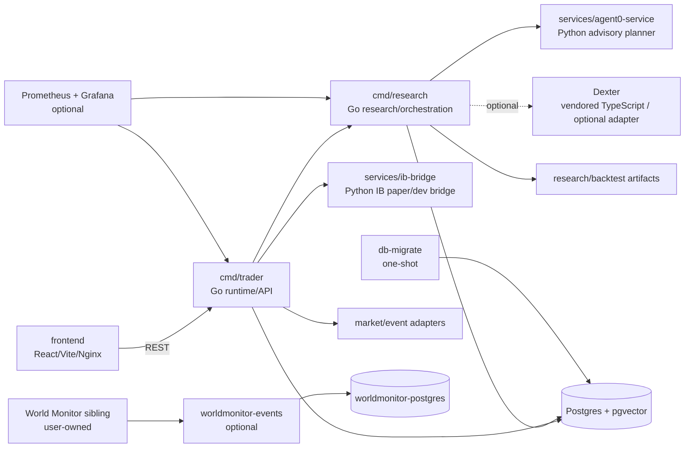
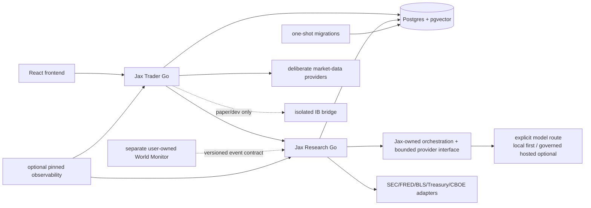

# Jax Commercial-Readiness CR-01 — Architecture, Vendor, Dependency & Ownership Audit

Audit date: 2026-09-09  
Repository: `C:\Projects\Jax\jax-trading-assistant`  
Branch at audit start: `capability-reset`  
Starting HEAD: `33147d5e509a3ded67b60a1d085e81972931eb67`  
Scope: CR-01 audit and cleanup plan only. No major removals or runtime behaviour changes were made.

## Executive summary

Jax's supported application path is a Go-led modular monolith with a Go trader,
Go research runtime, Postgres persistence, a separate Python IB bridge, a
Python `agent0-service` adapter, and a React frontend. Root Compose also
declares observability and World Monitor services. This is materially smaller
than the repository tree suggests: archived services are excluded from the
active workspace, Dexter is optional and not started by root Compose, the
embedded `Agent0/` research project is not the active Agent0 service, and the
LiteLLM stack is optional rather than required by the supported runtime.

The audit found no blocking CR-01 finding that prevents producing a cleanup
plan. It did find cleanup prerequisites that remain explicit: formal commercial
rights review, complete ownership/notice records for embedded third-party trees,
validation of the external World Monitor checkout, and contract-preserving
replacement/removal tests before destructive CR-02 work.

Scientific and safety status is unchanged:

- `HYP-EVENT-001A` remains `NOT VALIDATED`.
- `TRADING EDGE NOT DEMONSTRATED / INSUFFICIENT SAMPLE` remains in force.
- `Phase 13` is `NOT STARTED / BLOCKED BY CLEANUP GATE`.
- `ALLOW_LIVE_TRADING=false`, `BROKER_EXECUTION_ALLOWED=false`, live worker disabled and maximum leverage `1x` remain required.
- No approvals, candidates, tickets, orders, trades, fills or portfolio mutations were created by this audit.

## Current architecture

The diagram is derived from `docker-compose.yml`, `cmd/trader`,
`cmd/research`, `internal/modules/orchestration`, `services/agent0-service`,
`services/ib-bridge`, and the frontend API client, not from archived proposals.

### Component inventory

| Component | Source / runtime | Actual role and dependencies | Start / usage evidence | Classification |
| --- | --- | --- | --- | --- |
| Trader | `cmd/trader`, Go | Canonical trader/API, market tools, safety policy, signal/risk/evaluation boundaries; Postgres and providers | Root Compose `jax-trader`; frontend calls its API | KEEP |
| Research runtime | `cmd/research`, Go | Research projects, backtest, orchestration and memory tools; Postgres; Agent0 client; optional Dexter client | Root Compose `jax-research`; Dexter URL defaults empty | KEEP |
| Migration job | `cmd/db-migrate`, Go | Applies active Postgres migrations | Root Compose `db-migrate`, one-shot | KEEP |
| Postgres | `postgres` with pgvector | Canonical application, research, audit and vector-capable persistence | Root Compose; trader/research depend on it | KEEP |
| Agent0 service | `services/agent0-service`, Python/FastAPI | Advisory planner/suggestion service; optional Ollama/OpenAI/Anthropic; memory and IB URLs | Root Compose `agent0-service` | CONSOLIDATE |
| Agent0 source tree | `Agent0/`, Python/RL research tree | Vendored external research project; not the root runtime | In repository; not in root Compose/go.work application modules | REMOVE after review |
| Dexter | `dexter/`, Bun/TypeScript; `libs/dexter`, Go client | Optional company-research adapter and tools server | Constructed only for non-empty URL; no root service | REMOVE after tests/review |
| Frontend | `frontend/`, React/Vite/TypeScript, Nginx | Operator UI and API client | Root Compose `frontend` | KEEP |
| IB bridge | `services/ib-bridge`, Python/FastAPI/ib-insync | Broker-facing paper/dev market-data and execution bridge | Root Compose; explicit paper defaults | KEEP isolated paper/dev |
| World Monitor | `worldmonitor-events` plus `../Jax-World-News-Monitor` | User-owned external event ingestion and separate DB | Root Compose sibling build context; checkout absent here | KEEP separate; validate |
| Prometheus/Grafana | External images | Optional observability | Root Compose; not business-path prerequisite | DEFER |
| Redis | `go-redis` and historical/config references | Cache capability surface; no root service, current market cache disabled | No active root service found | REMOVE after proof |
| Qdrant | `tools/docker-compose.yml` profile | Development-only vector option | Tools profile only | REMOVE after proof |
| Hindsight | `archive/jax-memory`, historical config/docs | Archived memory runtime | Archive only; stale URL remains | Remove active references; retain archive |
| LiteLLM | `config/litellm`; `internal/modules/llmcontext` | Optional gateway client/stack and tests | Separate Compose; not root Compose | CONSOLIDATE |
| Backtest/evaluation | `libs/backtest`, `internal/modules/evaluation`, `evaluation/` | Frozen replay/backtest and research evidence | go.work and tests | KEEP |
| Paper trading | `internal/modules/papertrading` | Isolated paper order/fill/ledger/reconciliation | Go tests; no live path | KEEP |

The active Go workspace includes the application and library modules in
`go.work`; archived `archive/*` modules are not included. Root Compose declares
11 services: `ib-bridge`, `agent0-service`, `db-migrate`, `jax-trader`,
`jax-research`, `frontend`, `postgres`, `prometheus`, `grafana`,
`worldmonitor-events`, and `worldmonitor-postgres`.

## Agent0 verdict

**CAN AGENT0 BE REMOVED WITHOUT LOSING REQUIRED JAX CAPABILITY?**  
**YES, AFTER NATIVE REPLACEMENT.**

`cmd/research/main.go` constructs a Go `Agent0Client` using
`AGENT0_SERVICE_URL`; the client calls `/v1/plan`, `/v1/execute`, and
`/health`. `internal/modules/orchestration` recalls memory, optionally obtains
Dexter research, builds context, calls the Agent0 planner, invokes a bounded
no-op `ToolRunner`, and retains the result. Root Compose starts
`services/agent0-service` on port 8093. Its default provider is local Ollama;
OpenAI and Anthropic are optional paid paths.

The service is a real advisory boundary today, so immediate deletion would
break `/orchestrate` unless the Go research runtime first receives a native
planner/advisory adapter or the endpoint is explicitly retired. It does not own
canonical recommendation, risk, approval, paper intent or live execution
authority. Those boundaries already exist in Jax-owned Go modules.

The smallest replacement is a Go-owned `Planner` interface behind the existing
orchestration service, initially with deterministic bounded planning and an
explicit optional model provider. It must preserve the research-only output
contract and fail closed when no planner is available. CR-02B must add contract,
replay and deployment tests before removing the Python service.

The embedded `Agent0/` tree is separate: its README identifies
`aiming-lab/Agent0`, its local `LICENSE` is Apache-2.0, and it contains about
1,016 tracked files of training/RL code including an embedded `verl` area. It
is not an active root runtime dependency. Removal from commercial distribution
is feasible after formal provenance, copyright, notice and licence review; it
is not deleted in CR-01.

## Dexter verdict

**CAN DEXTER BE REMOVED WITHOUT LOSING REQUIRED JAX CAPABILITY?**  
**YES.**

`cmd/research` defaults `DEXTER_SERVICE_URL` to empty; the optional Go client is
constructed only when configured. `config/jax-core.json` sets `useDexter` false,
root Compose starts no Dexter service, and `config/providers.json` contains a
stale `http://dexter:3000/tools` entry. The Dexter tools server describes a
mock/simple server whose real implementation can be wired later.

The tree contains 57 tracked files, a Bun/TypeScript application, LangChain
OpenAI/Anthropic/Google/Tavily packages, and an `UPSTREAM.md` pointer to
`virattt/dexter`. Its README states MIT licensing, but complete notice and
modification review remains required. CR-02A can remove it after proving the Go
orchestration path and config/docs no longer expose it.

## LiteLLM verdict

**LITELLM STATUS = CONSOLIDATE.**

LiteLLM has a coherent optional local gateway in `config/litellm`, and
`internal/modules/llmcontext` contains a client, cost wrapper and tests. It is
not in root Compose; the active hosted diagnostic path calls OpenAI directly,
and Agent0 also contains direct provider calls. This is duplicated routing, not
a single required gateway. CR-02C must choose one deliberate Jax-owned
provider boundary while preserving cost/audit semantics; CR-01 makes no change.

## Separate repository dependencies

The only verified source/build dependency outside this repository is:

| Repository | Owner | Coupling | Evidence | Recommendation |
| --- | --- | --- | --- | --- |
| `C:\Projects\Jax-World-News-Monitor` | User-owned | Root Compose build context for `worldmonitor-events`; proof script hard-codes sibling path | Checkout absent in this environment; root Compose and `scripts/prove-live-world-monitor-ingestion.ps1` reference it | Keep separate; add version/presence/contract validation |

Searches across Compose, scripts, Makefiles, Go replace directives, go work,
frontend configuration, CI and non-archive runtime paths found no other
external source checkout. World Monitor is an environment/deployment
prerequisite, not a licence finding against user-owned source.

## External provider matrix

These are strategic classifications, not deletion actions or legal conclusions.
`FORMAL COMMERCIAL RIGHTS REVIEW REQUIRED` means local evidence is insufficient
to establish commercial usage, retention or redistribution rights.

| Provider | Purpose / source | Runtime status and credentials | Classification |
| --- | --- | --- | --- |
| OpenAI | Hosted diagnostics/research and optional chat (`cmd/hyp-event-classifier`, `internal/modules/aishadow`, chat) | Active but gated; `OPENAI_API_KEY` / `JAX_OPENAI_EXPERIMENT_API_KEY`; private evidence; rights review required | CONSOLIDATE |
| Ollama | Local Agent0 and AI-shadow inference | Active local/default; no provider key | KEEP |
| Interactive Brokers | Paper/dev bridge and optional execution adapter | Active isolated paper/dev; `IB_*`; rights/terms review required | KEEP isolated |
| Alpaca | Historical/current market data | Active/research-capable; `ALPACA_API_KEY`, secret, feed/tier; data-rights review required | CONSOLIDATE |
| Polygon / Massive | Market/event fallback alias and HTTP adapter | Optional; Polygon disabled in current market config unless enabled; keys/base URL; rights review required | CONSOLIDATE |
| Finnhub | Earnings/news fallback | Optional; `FINNHUB_API_KEY`; rights review required | DEFER |
| NewsAPI | News fallback | Optional; `NEWSAPI_KEY`; rights review required | DEFER |
| Financial Datasets | Financial evidence/market provider and Dexter dependency | Optional/research; `FINANCIAL_DATASETS_API_KEY`; prior closure recorded HTTP 401; rights review required | DEFER |
| Anthropic | Agent0 optional provider / Dexter dependency | Not supported-root default; `AGENT0_ANTHROPIC_API_KEY` | REMOVE from supported path after cleanup |
| Google Gemini | Dexter LangChain provider | Not supported-root path | REMOVE from supported path after cleanup |
| Tavily | Dexter optional search | Not supported-root path | REMOVE from supported path after cleanup |
| Telegram | Approval/notification dispatcher | Optional active; bot token/chat ID; terms/privacy review required | DEFER |
| Redis | Cache | No root service; cache disabled in current market config | REMOVE after reference proof |
| LiteLLM | Optional local AI gateway | Separate Compose; `AI_GATEWAY_*`; not root runtime | CONSOLIDATE |
| Qdrant | Tools-only vector profile | Development-only optional | REMOVE after tools proof |

No classification authorizes purchasing, new credentials or live execution.
Polygon/Massive are treated as one market-data capability for cleanup rather
than two independently justified vendors.

## Authoritative public-source matrix

| Source | Role | Status / authentication | Provenance role | Classification |
| --- | --- | --- | --- | --- |
| SEC / EDGAR | Filing, accession, XBRL and event evidence | Implemented in `libs/sec`; `SEC_USER_AGENT`, `SEC_CONTACT` | Raw-first identity, acceptance/publication time, normalized evidence | KEEP |
| FRED / ALFRED | Macro observations and vintages | Implemented in `libs/fred`; key where required | Vintage/revision semantics | KEEP |
| BLS | Official release calendar/evidence | Implemented in `libs/bls`; public path | Release timing and raw evidence | KEEP |
| Treasury | Rates/context | Implemented in `libs/treasury`; public path | Raw/provider provenance | KEEP |
| CBOE | VIX historical data | Implemented/referenced in `libs/cboe`; public CSV | Volatility provenance | KEEP |
| EIA | Energy/macro source | Referenced in roadmap/evidence; no confirmed active adapter found | Future/reference only | DEFER |
| CFTC | Commitment-of-traders source | Referenced in roadmap/evidence; no confirmed active adapter found | Future/reference only | DEFER |
| World Monitor | User-owned event source | Compose integration when sibling checkout exists | Event-ingestion provenance | KEEP separate |

## Embedded third-party source inventory

| Tree | Origin / licence evidence | Active requirement | Outcome |
| --- | --- | --- | --- |
| `Agent0/` | `UPSTREAM.md` points to `aiming-lab/Agent0`; local Apache-2.0 licence; substantial research/RL tree | Not required by root Go runtime or Compose | Remove candidate after formal provenance/notice review |
| `dexter/` | `UPSTREAM.md` points to `virattt/dexter`; README states MIT; no equivalent top-level licence file found | Optional adapter only; no root service | Remove candidate after contract/rights review |
| `archive/*` | Historical paths and documentation identify archive | Not in go.work/root Compose | `ARCHIVE INTENTIONALLY RETAINED` |
| `services/agent0-service` | Application service source; provider names and dependencies documented | Active advisory boundary | Treat as Jax integration code; confirm ownership in release review |

Ownership is not inferred solely from naming. A commercial release still needs
complete copyright notices, source modifications, transitive licences and
required attributions.

## OSS dependency summary

The root Go module is `jax-trading-assistant` (Go 1.24) with local replaces for
Jax libraries; `go.work` includes active modules and excludes archives. Notable
dependencies include pgx, golang-migrate, UUID/JWT, Alpaca, Polygon, IB,
Redis, decimal, circuit breaker, calendar parsing, SQL mocking, YAML and
`golang.org/x/*`. `go.sum` pins versions, but no SPDX/SBOM artefact exists.

`frontend/package.json`/`package-lock.json` define React, Vite, TypeScript, MUI,
Radix, TanStack, charting, markdown, testing and Playwright. `dexter/package.json`
and `bun.lock` define a separate Bun application with LangChain providers,
React/Ink, Zod and dotenv. Python manifests cover FastAPI/Uvicorn/HTTPX/Pydantic,
ib-insync, websockets, yfinance, pandas and dotenv. The dependency manifests
are visible, but a complete machine-readable licence inventory is not.

Active images include Go/Alpine builders, Python 3.11-slim, Node 22-alpine,
Nginx 1.27-alpine, Postgres 16/pgvector, Prometheus, Grafana and the World
Monitor database. Optional stacks use floating LiteLLM `main-latest`, Ollama
`latest` and Qdrant `latest`; CR-02 should pin approved tags/digests after
compatibility checks. No image changed in CR-01.

## Configuration and credential surface

Only names and paths were inspected. Secret values were not printed, copied or
committed. The root `.env` contains names for core DB, IB, runtime safety,
provider, SEC, OpenAI, Alpaca, Financial Datasets, Finnhub, NewsAPI, Massive
and Agent0 settings. `.env.example` does not fully mirror the operational
provider names observed in `.env`; this is a configuration gap, not permission
to expose or migrate secrets.

| Surface | Significant settings | Status | Finding |
| --- | --- | --- | --- |
| Safety | `ALLOW_LIVE_TRADING`, `BROKER_EXECUTION_ALLOWED`, `EXECUTION_ENABLED`, `EXECUTION_INSTRUCTION_WORKER_ENABLED`, `MAX_LEVERAGE` | ACTIVE | Fail-closed defaults; preserve in cleanup tests |
| Core DB/auth | `DATABASE_URL`, Postgres and JWT/bootstrap settings | ACTIVE | Secret-bearing; keep established loading |
| Agent0 | `AGENT0_LLM_PROVIDER`, `AGENT0_*` provider/model/memory/IB settings | ACTIVE / OPTIONAL ACTIVE | Required while service remains; duplicate provider surface |
| Orchestration | `JAX_ORCHESTRATOR_URL`, `MEMORY_SERVICE_URL`, `AGENT0_SERVICE_URL`, `DEXTER_SERVICE_URL` | ACTIVE / OPTIONAL / LEGACY | Dexter optional; stale config endpoint exists |
| AI gateway | `AI_GATEWAY_BASE_URL`, `AI_GATEWAY_API_KEY`, `AI_DEFAULT_MODEL`, `AI_ALLOW_DIRECT_PROVIDER` | OPTIONAL ACTIVE / UNKNOWN | Gateway/direct paths overlap |
| Hosted experiment | `JAX_OPENAI_EXPERIMENT_API_KEY`, `OPENAI_API_KEY`, `JAX_AI_HOSTED_INFERENCE_AUTHORIZED` | RESEARCH ACTIVE / GATED | Private research-only path |
| Market providers | Alpaca, Polygon/Massive, Finnhub, NewsAPI, Financial Datasets names | OPTIONAL ACTIVE | Overlap and rights/entitlement review |
| Public evidence | `SEC_USER_AGENT`, `SEC_CONTACT`, `FRED_API_KEY` | ACTIVE / OPTIONAL | Preserve provenance and secret handling |
| IB bridge | `IB_*`, `IB_PAPER_TRADING`, `AUTO_CONNECT` | ACTIVE PAPER/DEV | No live authority |
| Notifications | Telegram token/chat settings | OPTIONAL ACTIVE | Retain only if operator workflow requires |
| Legacy memory/cache | `HINDSIGHT_URL`, Redis settings | LEGACY / UNKNOWN | No active root service; remove only after proof |
| Test/CI | `TEST_*`, `SKIP_INTEGRATION`, readiness flags | ACTIVE TEST / CI | Preserve test semantics |

No configured secret is called unused solely because its provider is optional.
CR-02 must prove consumer absence and update examples, Compose, scripts, tests
and docs together.

## Docker/runtime surface

Root Compose has 11 declared services. The practical split is:

- core path: `postgres`, `db-migrate` (one-shot), `jax-trader`, `jax-research`,
  and `frontend`;
- current full integration dependencies: `ib-bridge` and `agent0-service`;
- optional operations: `prometheus` and `grafana`;
- optional external ingestion: `worldmonitor-events` and
  `worldmonitor-postgres`.

Thus the declared current Compose surface is **11 services**. A minimal
user-facing path could be **5 long-lived services plus the migration job** if
IB and Agent0 are replaced or made optional; retaining those capabilities makes
the current core **7 services including the migration job**. These are
planning counts, not deletion authorization.

Separate `config/litellm/docker-compose.yaml`, `tools/docker-compose.yml`,
`docker-compose.shadow.yml` and `db/postgres/docker-compose.yml` represent
optional, testing or alternative database surfaces. Floating tags, sibling
build contexts, provider secrets and optional dependencies are the principal
deployment findings. No ports, volumes or services changed.

## Dead / legacy code audit

- `archive/` is intentionally retained history and excluded from the active
  workspace; it is not an active runtime dependency.
- `config/providers.json` has an unbacked Dexter endpoint while active config
  disables Dexter.
- `HINDSIGHT_URL` and archived Hindsight references remain stale configuration;
  active memory is Postgres-backed through `jax-research`.
- Redis and Qdrant appear in dependency/tooling surfaces but are not active root
  services.
- Generated executables, logs, screenshots and local runtime folders are present;
  release packaging should define inclusion/exclusion later.
- Legacy broker/execution code must not be reactivated during cleanup; safety
  defaults and execution-worker disabled status remain authoritative.

## Licence / commercial-readiness findings

This is not a legal opinion. The current technical release-readiness gaps are:

1. No clearly identified root application licence/notice policy was found.
2. No generated SPDX dependency inventory or SBOM covers Go, JavaScript,
   Python and container layers.
3. `Agent0/` has Apache-2.0 evidence and `dexter/` states MIT, but copied-source
   modifications, complete notices and embedded subproject terms need review.
4. Provider data terms, retention and redistribution rights are not established
   by local adapter code; formal commercial rights review is required.
5. World Monitor is user-owned external software and needs separate ownership/
   deployment recording.
6. Floating container tags need reproducible pinning and provenance records.

Recommend a future `THIRD_PARTY_NOTICES` document plus machine-readable SBOM,
with formal licence and data-rights review before commercial release. This audit
does not state that Jax is legally safe to sell.

## Classification matrix

| Group | Classification | Evidence |
| --- | --- | --- |
| Jax Go trader/research/contracts/risk/workflow/paper/replay/persistence | KEEP | Active supported business and canonical safety capability |
| Postgres/pgvector/migrations | KEEP | Current source of truth and accepted migration architecture |
| Frontend and IB paper/dev bridge | KEEP | Current operator and isolated paper capability |
| SEC/FRED/BLS/Treasury/CBOE adapters | KEEP | Implemented primary evidence/provenance roles |
| World Monitor | KEEP separate | User-owned external event capability |
| Agent0 service/client | CONSOLIDATE | Active advisory boundary duplicates Jax orchestration/provider routing |
| LiteLLM/direct AI clients | CONSOLIDATE | Overlapping gateway and direct paths |
| Alpaca plus Polygon/Massive | CONSOLIDATE | Overlapping market-data roles |
| Embedded Agent0 tree | REMOVE after review | External application source, not active runtime |
| Dexter tree/client/config | REMOVE after review | Optional and unstarted by supported root path |
| Redis/Qdrant | REMOVE after reference proof | No current business-path service |
| Anthropic/Gemini/Tavily | REMOVE from supported path after cleanup | Only Agent0/Dexter paths |
| Finnhub/NewsAPI/Financial Datasets, Telegram, Prometheus/Grafana | DEFER | Optional capabilities requiring deliberate qualification |
| EIA/CFTC | DEFER | Referenced but no confirmed active adapter |
| Archives | KEEP as archive | Preserve history; not active architecture |

## Target post-cleanup architecture

This is a proposed direction, not authorization to remove components in CR-01.

## Ordered CR-02 cleanup plan

### CR-02A — Dexter removal

Confirm no production `DEXTER_SERVICE_URL`, query consumer or deployment relies
on it; remove stale config exposure; complete upstream/licence review; test
orchestration without Dexter and replay compatibility. Affected paths are
`dexter/`, `libs/dexter/`, orchestration adapters/service/tests, `cmd/research`,
config and docs. Rollback is one bounded commit retaining the tree until tests
pass.

### CR-02B — Agent0 native replacement/removal

Map `/v1/plan` and `/v1/execute` consumers, define the Jax planner contract and
decide whether advisory planning remains supported. Affected paths include
`services/agent0-service/`, `libs/agent0/`, orchestration, Compose, bootstrap,
examples, CI and tests. Replace with a Go-native bounded provider interface,
then test startup without Agent0, replay, permissions and frontend flows. Keep a
temporary compatibility boundary for rollback; never delete the embedded tree
without rights review.

### CR-02C — LiteLLM/provider consolidation

Inventory all direct and gateway calls, choose the deliberate Jax-owned
provider boundary, and preserve cost/audit/offline tests. Affected paths are
`config/litellm/`, `internal/modules/llmcontext/`, chat, AI-shadow, config and
tests. Do not remove the stack until equivalent routing and secret-loading tests
pass.

### CR-02D — Market/vendor cleanup

Complete entitlement and data-rights review, choose deliberate primary/fallback
market sources, and update `libs/marketdata`, trader tools, config, Compose,
examples and tests. Preserve feed/timestamp/adjustment and historical replay
identity. Use provider-by-provider bounded commits.

### CR-02E — Environment/Compose/config cleanup

Prove all consumers, validate the World Monitor checkout, reconcile alternate DB,
shadow and tools stacks, pin images, and make required/optional profiles
explicit. Test Compose rendering, readiness, migrations, CI parity and safety
defaults. Do not remove sibling functionality silently.

### CR-02F — Dependency/licence/SBOM cleanup

After the architectural decisions and formal rights review, add
`THIRD_PARTY_NOTICES`, an SPDX/SBOM artefact, embedded-source notices and image
provenance. Test lockfile consistency, notice completeness and reproducible
build metadata. Automated licence guesses must not drive source deletion.

### CR-02G — Final validation

After all bounded changes, rerun the complete Go/Python/frontend/Compose suite,
safety/adversarial review, packaging checks and external technical-lead review.
Rollback by reverting bounded commits; never rewrite history.

## Blockers and unknowns for later review

- The World Monitor checkout is absent here; deployment reproducibility cannot
  be claimed until version/availability is recorded.
- Root licence/notice/SBOM readiness and provider terms/entitlements require
  formal review.
- The distinction between active Python `agent0-service` and embedded external
  `Agent0/` requires an ownership/release decision.
- The Go Agent0 interface exposes `/v1/execute`, while the inspected service
  entry point did not establish a corresponding supported endpoint; test before
  removal.
- Production deployment may use a profile/environment not visible in local
  Compose/CI; confirm before CR-02 deletion.
- Floating image tags reduce reproducibility until pinned.
- Race/scientific status are not changed by this audit: HYP-EVENT-001A remains
  not validated and Phase 13 remains blocked.

## Verification and adversarial review

The documentation-only change was verified on the final pre-commit tree with:

- `go test ./... -count=1` — PASS.
- `go vet ./...` — PASS.
- `npm run test` in `frontend` — PASS (56 files, 156 tests).
- `npm run lint` in `frontend` — PASS.
- `npm run typecheck` in `frontend` — PASS.
- `npm run build` in `frontend` — PASS.
- `docker compose config --quiet` — PASS; configuration was not emitted.
- `git diff --check` — PASS.

The frontend build reported non-blocking warnings about an older Browserslist
database, React Router future flags and large output chunks. No provider API,
hosted inference, broker call, migration, data acquisition or credential
operation was performed. The CR-01 adversarial review checked hidden Agent0/
Dexter runtime use, optional/config-only references, sibling build contexts,
provider aliases, CI and frontend surfaces, archive boundaries and proposed
functionality loss. `Blocking CR-01 audit findings remaining: 0`.

## Audit conclusion

`Blocking CR-01 audit findings remaining: 0`

CR-01 has produced the required current architecture, vendor/dependency/
ownership audit and bounded cleanup plan. It does not claim commercial
clearance or authorize immediate provider/service removal. External
technical-lead review is required before CR-02 destructive consolidation.
